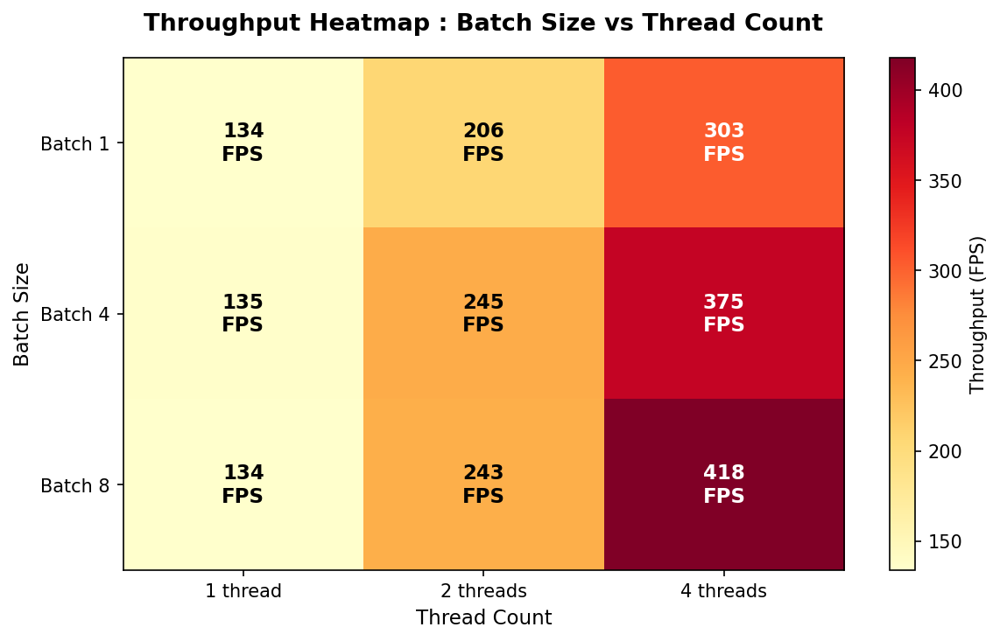
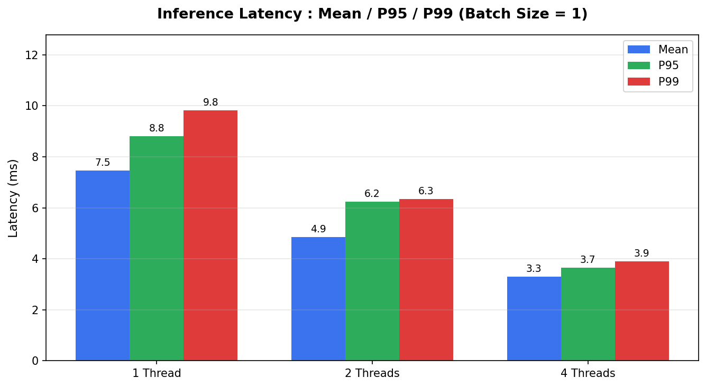
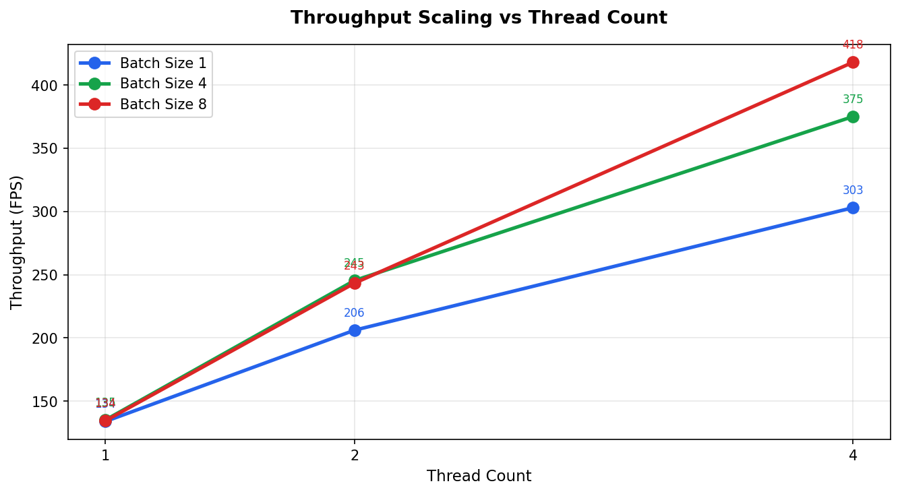
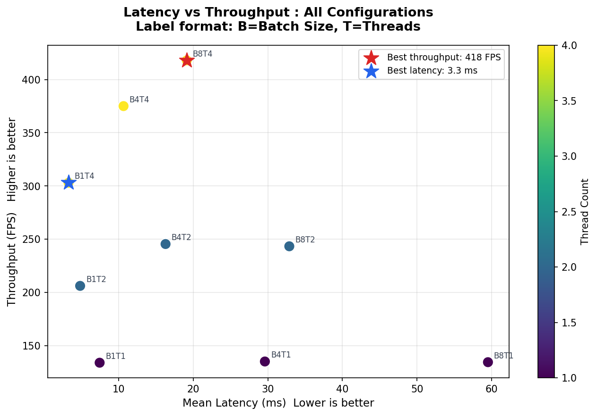
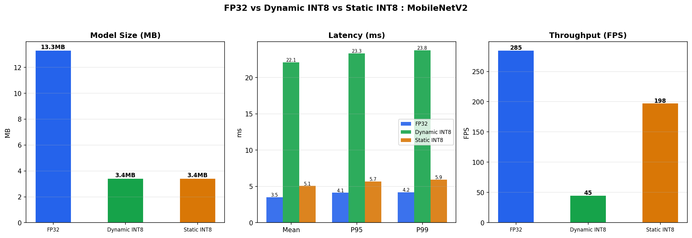

# ML Inference Benchmarking Tool


A cross-platform ML inference benchmarking tool built with **C++17**, **ONNX Runtime**, **CMake**, and **Python**.

Measures latency, throughput, and memory usage of neural network inference across different batch sizes, thread counts, and precision formats (FP32, Dynamic INT8, Static INT8) — the kind of performance analysis done on ML hardware at companies like Qualcomm, Microsoft, and Google.

---

## Results — MobileNetV2 on CPU

### Threading & Batch Size Sweep

| Config | Mean Latency | P99 Latency | Throughput |
|--------|-------------|-------------|------------|
| Batch=1, Threads=1 | 7.47 ms | 9.58 ms | 133.8 FPS |
| Batch=1, Threads=2 | 5.00 ms | 6.90 ms | 199.8 FPS |
| Batch=1, Threads=4 | 3.25 ms | 3.85 ms | **307.2 FPS** |
| Batch=4, Threads=4 | 10.30 ms | 11.93 ms | 388.3 FPS |
| Batch=8, Threads=4 | 19.54 ms | 22.43 ms | **409.4 FPS** |

> Best latency: **3.25ms** (Batch=1, Threads=4) — Best throughput: **409 FPS** (Batch=8, Threads=4)

### Throughput Heatmap — Batch Size × Thread Count



### Latency — Mean / P95 / P99 per Thread Count



### Throughput Scaling vs Thread Count



### Latency vs Throughput Tradeoff



---

## Quantization Results — FP32 vs Dynamic INT8 vs Static INT8

| Metric | FP32 | Dynamic INT8 | Static INT8 |
|--------|------|--------------|-------------|
| Model size | 13.3 MB | 3.4 MB | 3.4 MB |
| Size reduction | — | **74% smaller** | **74% smaller** |
| Mean latency | 3.51 ms | 22.09 ms | 5.06 ms |
| P99 latency | 4.18 ms | 23.76 ms | 5.92 ms |
| Throughput | 285 FPS | 45 FPS | 198 FPS |

> **Key finding:** Static INT8 quantization achieves 74% model size reduction with only 1.4× latency overhead on x86 CPU,
> significantly outperforming dynamic INT8 (6.3× slower than FP32).
> Dynamic quantization dequantizes weights to FP32 at runtime on x86, adding overhead without hardware acceleration.
> On Qualcomm Snapdragon NPU with native INT8 support, static INT8 would be expected to outperform FP32 on latency as well.



---

## Architecture
```
ml-inference-benchmark/
??? cpp/
?   ??? main.cpp                 # Entry point — config sweep + JSON output
?   ??? benchmark_runner.h       # BenchmarkConfig / BenchmarkResult structs
?   ??? benchmark_runner.cpp     # ONNX Runtime inference + timing + memory
??? python/
?   ??? download_model.py        # Downloads MobileNetV2 from ONNX Model Zoo
?   ??? run_benchmark.py         # Full pipeline orchestration (one command)
?   ??? visualize.py             # Generates 4 benchmark charts
?   ??? quantize_model.py        # Dynamic INT8 quantization
?   ??? static_quantize.py       # Static INT8 with COCO calibration data
?   ??? compare_models.py        # Three-way FP32 vs INT8 comparison
??? CMakeLists.txt               # Cross-platform build (WIN32/UNIX guards)
??? .github/workflows/
    ??? ci.yml                   # GitHub Actions — Windows (MSVC) + Linux (GCC)
```

---

## Tech Stack

| Layer | Technology |
|-------|-----------|
| Inference Engine | ONNX Runtime 1.24.4 (C++ API) |
| Build System | CMake 3.20+ |
| Compiler | MSVC (Windows) / GCC (Linux) |
| Orchestration | Python 3.12+ |
| Quantization | onnxruntime.quantization (dynamic + static) |
| Calibration Data | COCO val2017 dataset |
| Visualization | matplotlib, pandas |
| CI/CD | GitHub Actions (Windows + Linux) |

---

## Quick Start

### Prerequisites
- Visual Studio 2022 with C++ workload (Windows) or GCC (Linux)
- CMake 3.20+
- Python 3.10+
- ONNX Runtime SDK — download
  [onnxruntime-win-x64-1.24.4](https://github.com/microsoft/onnxruntime/releases/tag/v1.24.4)
  and extract to `third_party/`

### Build

**Windows (Developer PowerShell):**
```powershell
cmake -B build -S . -DCMAKE_BUILD_TYPE=Release
cmake --build build --config Release
```

**Linux:**
```bash
cmake -B build -S . -DCMAKE_BUILD_TYPE=Release
cmake --build build
```

### Run Full Benchmark Pipeline
```powershell
py python/run_benchmark.py
```

### Run Quantization Comparison
```powershell
py python/quantize_model.py          # Dynamic INT8
py python/static_quantize.py         # Static INT8 (downloads calibration images)
py python/compare_models.py          # Three-way comparison + chart
```

---

## Key Engineering Decisions

**Why ONNX Runtime?**
Industry-standard inference engine used by Qualcomm, Microsoft, Meta, and Google.
Supports CPU, GPU, and Qualcomm NPU via the Execution Provider abstraction —
switching from CPU to Snapdragon NPU requires changing one line of code.

**Why P95/P99 latency?**
Mean latency hides tail latency. Production SLAs are always defined in percentiles.
P99 = "99% of users experience this latency or better." Reporting mean alone is misleading.

**Why warmup runs?**
First inference runs are slower due to cold CPU caches and OS memory paging.
5 warmup runs are discarded before measurement to capture steady-state performance.

**Why static > dynamic INT8 on CPU?**
Dynamic quantization dequantizes weights back to FP32 at runtime on x86 CPUs,
adding overhead without hardware INT8 acceleration. Static quantization pre-quantizes
both weights and activations, reducing runtime conversion. Native INT8 speedup
is realized on hardware with dedicated INT8 units — Qualcomm Snapdragon NPU, ARM
dot-product extensions, Intel VNNI.

**Why CMake over platform-specific build scripts?**
CMake generates native build files for each platform from a single `CMakeLists.txt`.
WIN32/UNIX guard blocks handle platform differences internally — no sed scripts,
no file modification, no fragile string matching.